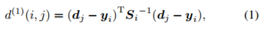
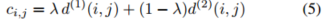

# deep-sort翻译

原文链接:https://arxiv.org/abs/1703.07402

SORT是一个处理MOT问题的有效的算法。在这篇论文中我们提高了SORT的性能。由于这个扩展我们在tracking物体的时候可以应对遮挡物更长时间的遮挡，有效的减少了id的切换。在原来框架的基础上，我们将一些复杂的计算放在了预先训练阶段，我们在一个大规模的person re-id数据集上训练了一个深度关联网络。在做tracking的时候我们使用查询附近的邻居的（knn; k=1）方法在视觉外观空间（在detection的bounding box上提取特征）建立了detection和track的关联。实验的评估显示了我们减少了45%的id切换，在高帧率的条件下提高了整体的性能。

1.简介

由于最近物体识别的进展，tracking-by-detection已经成为了多物体tracking的主流方法。在这个范例当中，找出物体轨迹通常变成了批处理整个视频的一个全局优化问题。例如flow network formulations[1,2,3]以及概率图模型[4,5,6,7]都是这种方法的流行框架。然而由于是批处理，这种方法不适用于需要在每个时间点实时给出一个目标的id的场景当中（摄像头监控，直播流）。更传统的方法是MHT[8]和JPDAF[9]。这些方法是逐帧的进行数据关联。在JPDAF中，通过给每个测量结果加权生成关联的概率来作为单一状态的估计。在MHT中追踪所有的可能性，但是必须使用一些化简计算的方法。两种方法最近都有被一个tracking by detection scenario[10,11]中提及，被证明是较有希望的方法。但是这些方法的性能提升都是用增加的计算量以及实现的复杂度带来的。

SORT是一个更简单的方法，它在图像空间运用了卡尔曼滤波器，用了匈牙利算法法做数据关联，关联的标准是bounding box的重合度(IOU)。这个方法在高帧率下获得了不错的性能。在MOT challenge数据集上 SORT结合了一个先进的行人detector获得了比MHT更好的成绩。它不仅证明了detector的性能对tracker的性能有很重要的影响，对实践者来说也是一个很重要的解决问题的思路。

虽然在tracking的accuracy和precision上有所提升，但是它的id切换更加严重。这是因为所采取的数据关联标准(IOU)只有在位置状态估计的不确定性低的情况下才比较准确。因此SORT在有遮挡物的时候表现不佳(我猜测是在两个物体叠加的时候框仅仅计算IOU的精度很低，会导致串框)。我们通过替换掉关联度量标准，改使用一个结合了运动和外观信息的度量标准来客服了这一缺点。我们用了一个大规模的行人重识别的数据集训练了一个CNN来区分行人。通过整合这个网络，我们提高了对于目标丢失以及遮挡情况的鲁棒性，同时保持了系统的简洁，高效。我们的代码和预先训练好的CNN模型将会公开。

2.深度特征作为关联度量标准的SORT

我们采用了传统的单一假设tracking的方法，使用递归卡尔曼滤波器和逐帧的数据关联。接下来我们将会介绍这个系统的核心组件。

2.1.track处理和状态估计

Track的处理以及卡尔曼滤波器的使用和原始的SORT框架[12]大体相同。
我们先假定一个非常通用的tracking场景，相机是没有校准的，我们也没有可用的帧间运动的信息。虽然这些条件给我们的滤波器带来了一定的挑战，但是这是MOT benchmark中的很常见的场景[15]。因此我们的tracking 场景是在八维的状态空间表示的:。
(u,v)是bounding box的中心坐标，r表示长宽比，h表示高度，以及它们各自在图像当中的速度。我们的卡尔曼滤波器用了一个匀速直线运动的模型，将(u,v,r,h)作为bounding box的观测值。每次成功做了数据的关联后开始对帧计数k。在卡尔曼滤波器对某帧做预测的时候计数器加一，当track的目标和测量值成功做关联后计数器置零。当计数器达到了一个预定义的最大值A_max的时候，就认为该目标已经离开了场景，将其从track集当中删除。当一个detection(测量值)不能被关联到任何一个现有的tracker上的时候，就初始化一个新的tracker。新的tracker在前3帧被认为是试用期，在此期间，我们期望每一帧都可以成功的做数据关联，如果在试用期数据关联没有成功，该tracker就会被删除。

2.2.关联问题

解决将卡尔曼滤波器预测值和测量值(detection)关联起来的问题的传统方法是将其看成赋值问题用匈牙利算法来求解(就是SORT中用的方法)。在这个问题中我们通过两个适当的指标来结合运动信息（位置）和外观信息（特征）。

为了合并运动信息，我们使用卡尔曼滤波器预测的状态和新到来的测量值之间的马氏距离(的平方)。

其中dj表示第j个detection的bounding box的位置，yi表示第i个tracker对目标的预测位置，Si是协方差矩阵。马氏距离将卡尔曼滤波器预测位置的不确定性考虑进去了。设置马氏距离的阈值t，当预测位置和detect位置的马氏距离的小于阈值的时候我们认为基于运动状态的关联成功。

如果第j个detect 的bounding box和第i个tracker预测的bounding box关联成功，bij为1。对于我们的4维测量空间，可以把马氏距离的阈值t设置为9.4877。

当目标的运动不确定性较低的时候，马氏距离是一个不错的数据关联的度量标准，但是在我们的图像空间当中，卡尔曼滤波器的预测值只能作为一个参考。特别是，当相机移动的时候会引入目标在图像平面内的快速位移，这使得马氏距离做为度量表准的时候有更多的不确定性。因此我们引入了第二个度量标准来做数据关联。对于每个detection的bounding box，我们引入一个外观的描述符（提取特征向量）rj，特征要做l2_norm, || rj || = 1。我们为每个目标的tracker构造一个特征集合，存储最近的100个成功关联的特征向量。然后我们的第二个测量标准就是第j个detection的bounding box的特征向量和第i个tracker的特征集合的最小cosine distance。(这里np.dot(ri,rj) 就是cosine相似度，1减去相似度可以当作距离)

同样的我们引入一个bool变量来表示基于外观特征的关联是否成功。

我们用t2来做阈值。实际上我们使用了一个预先训练好的CNN网络来计算bounding box的特征向量。网络的结构在2.4中介绍。

在我们的数据关联问题当中，两个度量指标根据问题的不同方面来互相补充。一方面马氏距离提供了目标可能出现的位置信息，这在短期的预测当中特别有用。另一方面余弦距离考量了外观特征，这对于被长时间遮挡后的re id特别有效。为了构建数据关联问题我们将马氏距离和余弦距离进行加权求和。（作者的代码里面是没有做这个加权求和的动作的，相当于这个lambda为0）

只有cij在两种度量阈值的交集内的时候我们才认为关联成功。

可以通过超参数lambda来控制这两个度量标准对关联的cost的权重。在实践当中我们发现如果camera有移动那么把lambda设为0是一个不错的选择，此时做数据关联的时候就会只考虑外观特征的匹配程度。然而马氏距离的度量在(6)中还是有用的，可以过滤掉完全不可能位置的数据关联。(译者注：在实践中如果视频的帧率不够，或者摄像头有移动，我们想要更相信特征来做数据关联，这个时候可能要把马氏距离的阈值t设置的大一点，否则会出现特征关联成功但是由于距离的原因导致关联失败)

2.3.级联匹配

在原来的SORT中我们将detection的bounding boxes和trackers预测的bounding boxes做关联的方法是通过全局的赋值问题来解决的(匈牙利算法)。这次我们采用了完全不同的算法，用级联的方式将赋值问题拆分成一个个的小问题来解决。考虑下面的这种情况，当目标被遮挡比较长的一段时间时，卡尔曼滤波器对该目标位置的预测会随着遮挡时间的增加而变得越来越不准(没有了detection的校准)。此时关联的cost应该对此有所反应，具体来说就是(5)式中的cost应该由于d1的增加而增加。但不幸的是当两个tracker争抢同一个detection的时候，由于马氏距离的特性导致预测不确定性更高的那个tracker会拿到该detection(具体原理这里没看懂)，这是我们不希望看到的，因为会导致不稳定的tracking。因此我们引入了级联匹配，让更常出现(没有被遮挡的)目标有更高的可能性获取该detection。

匹配算法：

上图是算法的伪代码。Tracker set T, 一帧内的detections D，以及最大的生命期Amax作为输入。第一行和第二行计算数据关联的cost矩阵C以及表示关联成功或失败的结果矩阵B。
然后迭代1-Amax，先处理丢失时间短的trackers后处理丢失时间长的trackers，这样可以解决上面提到的马氏距离带来的缺陷。在第6行选出已经n帧没有成功关联detection的trackers的子集Tn。第7行我们根据最小化cost的原则找出在Tn和D的集合中的的i和j的一一配对。第8行和第9行更新成功match的集合和未成功match的集合。11行返回结果。这个级联匹配的方法给了age更小的trackers以更高的优先级。

在匹配的最后阶段我们在未确认的detections和未匹配的trackers之间作之前SORT中用到的IOU关联[12]。这有助于处理由于部分遮挡导致的特征向量突变的问题。

2.4.深度特征提取

我们的方法需要一个预先训练好的特征提取组件，来满足实时的tracking。最后我们采用了一个CNN网络模型，它是在一个1100000的行人重识别的数据集[21]上训练得到的，非常适合我们的行人tracking环境。CNN的结构见下面的表1：

总之我们使用了一个深度残差网络，两层卷积层后面6个残差块。在第10层的全连接层输出128维，最后做一个batch l2 normalization。我们的网络有2800864个参数，32个bounding box在GTX1050显卡上做一次前向传播费时30ms。因此这个网络很适合做在线tracking。如何训练这个网络不在本文的讨论范围内，我们会提供一个预先训练好的模型在github上。