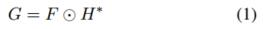
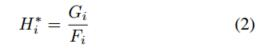
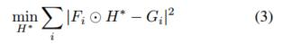

# MOSSE

## 摘要

虽然不常用，但是相关滤波器可以用作追踪物体(在包括旋转，遮挡，以及其他的干扰的情况下)，其速度是当前最先进的tracker技术的20倍以上。最古老并且最简单的相关滤波器使用简单的模板，在tracking的时候通常会失败。更现代的方法(ASEF,UMACE)效果会好一些，但是它们对训练的需求使得它们不适合用作tracking。视觉tracking需要从单个帧中训练出健壮的filter并可以根据目标对象的外观进行动态调整。

本篇论文提出了一种新的相关滤波器，最小化平方和误差滤波器(minimum output sum of squared error MOSSE),使用单帧初始化就可以产生稳定的相关滤波器。使用MOSSE滤波器的tracker可以在光照，尺度，姿态和非刚性变形的变化的情况下高效运行。帧率可以达到669FPS。tracker也可以应对物体被遮挡的情况。

视觉追踪在视频处理中有很多实际的应用。一个目标在一帧当中被定为后，在后续的帧中追踪该目标。目标被成功追踪的每一帧中我们都可以获取它的身份和活动轨迹信息。因为tracking比detection更简单，所以比起每一帧都做detection来说，tracking算法可以消耗更少的计算资源。

视觉追踪在近些年获得了很多的关注。出现了很多健壮的tracker,可以处理被追踪的目标的外观特征改变的情况，比如[17][1][19][2]。尽管很有效，但是这些方法都比较复杂。他们通常包括了复杂的外观特征模型，和/或则优化算法,导致很难跟上现在的摄像机的帧率(25~30FPS)，见表一。

在这篇论文中我们研究了一种简单的追踪策略。目标的外观由自适应的相关滤波器来建模，tracking经由卷积来做。简单的创建滤波器的方法，例如从图像中裁剪模板，可以为目标产生强大的峰值，但是也会对背景产生错误的相应。因此这个方法对目标的外观变化不是很健壮，在tracking挑战上失败了。ASEF,UMACE,MOSSE生成的滤波器更加的健壮，可以很好的区分出目标和背景。如图2所示，结果是一个更强的峰值，这就意味着更少的漂移，和更少的会被丢弃的track结果。传统上ASEF和UMACE滤波器需要离线的预先训练，并且用于物体的detection的目标识别。在这次的研究当中我们修改了这些技术，可以在一个自适应的区域进行在线训练，使其用于视觉tracking。结果就是我们可以达到顶尖的tracking性能，同时速度飞快，保持了底层的correlation的简单。

尽管方法很简单，但是仍然可以在旋转，尺度，光照，部分遮挡的情况下保持较好的性能。Peak-to-Sidelobe Ratio(PSR)测量相关性峰值的强度，可以用来发现物体的遮挡和tracking的失败，来结束在线更新，或者在出现一个相识外观特征的时候从新tracking。这些高级的相关滤波器实现了和前面提到复杂的trackers差不多的性能，但是我们快了20倍，达到了669的帧率。

本篇论文的组织结构如下，section 2回顾了相关滤波器技术，section 3介绍了MOSSE 滤波器，以及怎样使用它来实现一个健壮的tracker， section 4展示了用[17]里面的视频进行实验的实验结果。 section 5做总结。

## 2 背景

在20世纪80,90年代，有很多相关滤波器的变种，包括SDF[7,6],MVSDF[9],MACE[11],OTF[16],MSESDF[10]。。。。

## 3 基于相关滤波器的tracking

基于滤波器的tracker,使用在事例图像上训练的滤波器来建模目标的外观特征。目标一第一帧中对象的tracking window来初始化。从这一点开始，tracking和滤波器的训练开始工作。在下一帧中，通过将滤波器和搜索窗口的关联来跟踪目标。correlation的输出中的最大值的索引所对应的位置，就是目标的新位置。然后基于该位置做在线的更新。

为了创造一个快速的tracker，相关的计算要在傅里叶域进行(使用快速傅里叶变换FFT [15])。首先对输入图片和滤波器进行二维的傅里叶变换。根据卷积定理，相关的计算变成了傅里叶域的元素相乘。用⊙符号来表示元素相乘，用*来表示共轭复数。相关计算的公式就变成了
利用逆向的FFT来将输出转换回空间域。这个步骤的瓶颈是进行FFT的正向和反向计算。算法的复杂度是O(PlogP)其中P是tracking window中像素的个数。

在本部分，我们将讨论基于滤波器的tracker的组件。section 3.1讨论tracking window的预处理。section 3.2介绍了MOSSE滤波器，它是一种改进的方法，可以从少量的图像中构造一个稳定的相关滤波器。section 3.3介绍了用正则化来构建更加健壮的UMACE和ASEF滤波器。 section 3.4介绍了可以在线更新滤波器的简单策略。

### 3.1 预处理

FFT卷积算法的一个问题是图像和滤波器被映射到一个环面的拓扑结构。换句话说，图片的左边和右边连接在一起，上边和下边连接在一起。在卷积的过程中，图像在环形空间中旋转，而不是像空间域中那样进行转换。人为的连接图像的边界会引入一个副作用，它会影响相关的输出。通过遵循[3]中提到的步骤可以减少这种副作用。首先使用log函数来处理图像中的每个像素值来降低图像的对比度。然后将像素值归一化，均值为0，norm为1。最后图像诚意一个余弦窗口，它会逐渐将图像边缘的像素值设置成接近0。这样的好处是将重点放到目标的中心。

### 3.2 MOSSE 滤波器

MOSSE是一种从较少的训练图像中产生类似于ASEF的滤波器的算法。首先它需要一组训练图像fi和训练输出gi。通常来说gi可以是任意的形状。在这种情况下，gi是由事实产生的，它有一个紧凑的(sigma == 2)二维高斯分布形状的峰，峰值的中心就在训练图像fi中目标的中心。在傅里叶域中进行训练以利用输入和输出之间的简单的元素间相乘的关系。像前面的一节一样，我们使用大写的符号Fi,Gi,H来表示经过傅里叶变换后的输入，输出和滤波器。
(2)式中的除法表示元素相除。

为了找到可以将训练输入映射到期望的训练输出的滤波器，MOSSE会寻找一个滤波器H，可以使得实际输出的卷积和期望输出的卷积的误差平方和最小。最小化的动作可以用下面的公式来表示。

最小化误差平方和并不是一个新的点子。事实上公式3所表示的优化问题和[10][12]中提到的问题几乎是一样的。不同的是在他们的工作中都假定目标在图像fi的中间，训练集中所有的输出(gi)都是固定的。定制化每个gi是ASEF和MOSSE背后的核心思想。在tracking任务中目标并不总是在图片的中间。在更一般的情况下，gi可以是任意的形状。比如在[4]当中fi包含了多个目标，gi有多个对应的峰值。

