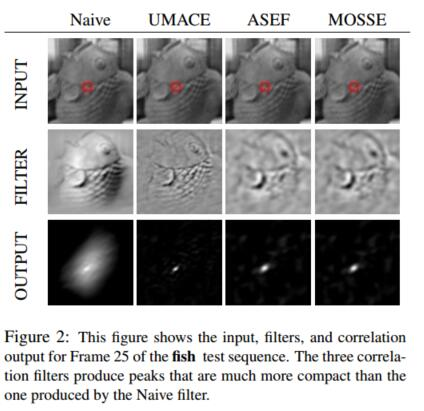

# MOSSE

## 摘要

虽然不常用，但是相关滤波器可以用作追踪物体(在包括旋转，遮挡，以及其他的干扰的情况下)，其速度是当前最先进的tracker技术的20倍以上。最古老并且最简单的相关滤波器使用简单的模板，在tracking的时候通常会失败。更现代的方法(ASEF,UMACE)效果会好一些，但是它们对训练的需求使得它们不适合用作tracking。视觉tracking需要从单个帧中训练出健壮的filter并可以根据目标对象的外观进行动态调整。

本篇论文提出了一种新的相关滤波器，最小化平方和误差滤波器(minimum output sum of squared error MOSSE),使用单帧初始化就可以产生稳定的相关滤波器。使用MOSSE滤波器的tracker可以在光照，尺度，姿态和非刚性变形的变化的情况下高效运行。帧率可以达到669FPS。tracker也可以应对物体被遮挡的情况。

视觉追踪在视频处理中有很多实际的应用。一个目标在一帧当中被定为后，在后续的帧中追踪该目标。目标被成功追踪的每一帧中我们都可以获取它的身份和活动轨迹信息。因为tracking比detection更简单，所以比起每一帧都做detection来说，tracking算法可以消耗更少的计算资源。

视觉追踪在近些年获得了很多的关注。出现了很多健壮的tracker,可以处理被追踪的目标的外观特征改变的情况，比如[17][1][19][2]。尽管很有效，但是这些方法都比较复杂。他们通常包括了复杂的外观特征模型，和/或则优化算法,导致很难跟上现在的摄像机的帧率(25~30FPS)，见表一。

在这篇论文中我们研究了一种简单的追踪策略。目标的外观由自适应的相关滤波器来建模，tracking经由卷积来做。简单的创建滤波器的方法，例如从图像中裁剪模板，可以为目标产生强大的峰值，但是也会对背景产生错误的相应。因此这个方法对目标的外观变化不是很健壮，在tracking挑战上失败了。ASEF,UMACE,MOSSE生成的滤波器更加的健壮，可以很好的区分出目标和背景。如图2所示，结果是一个更强的峰值，这就意味着更少的漂移，和更少的会被丢弃的track结果。传统上ASEF和UMACE滤波器需要离线的预先训练，并且用于物体的detection的目标识别。在这次的研究当中我们修改了这些技术，可以在一个自适应的区域进行在线训练，使其用于视觉tracking。结果就是我们可以达到顶尖的tracking性能，同时速度飞快，保持了底层的correlation的简单。

尽管方法很简单，但是仍然可以在旋转，尺度，光照，部分遮挡的情况下保持较好的性能。Peak-to-Sidelobe Ratio(PSR)测量相关性峰值的强度，可以用来发现物体的遮挡和tracking的失败，来结束在线更新，或者在出现一个相识外观特征的时候从新tracking。这些高级的相关滤波器实现了和前面提到复杂的trackers差不多的性能，但是我们快了20倍，达到了669的帧率。

本篇论文的组织结构如下，section 2回顾了相关滤波器技术，section 3介绍了MOSSE 滤波器，以及怎样使用它来实现一个健壮的tracker， section 4展示了用[17]里面的视频进行实验的实验结果。 section 5做总结。

## 2 背景

在20世纪80,90年代，有很多相关滤波器的变种，包括SDF[7,6],MVSDF[9],MACE[11],OTF[16],MSESDF[10]。。。。

## 3 基于相关滤波器的tracking

基于滤波器的tracker,使用在事例图像上训练的滤波器来建模目标的外观特征。
