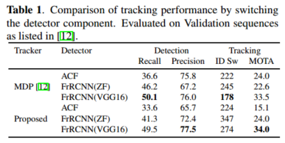
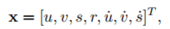

# sort翻译
原文链接:https://arxiv.org/pdf/1602.00763.pdf

这篇论文介绍了一个用tracking by detection模式解决多物体tracking(MOT)的良好的实现方法，在该模式中每一帧中detect的物体都用一个bounding box来表示。和很多batch based tracking（一个视频中的所有帧同时给出，可以进行批处理）方法[1][2][3]比较，本文介绍的方法主要针对在线tracking（比如tracking摄像头的数据，直播等），只有前面帧和当前帧被提供给tracker。

多物体追踪(MOT)问题也可以被看成数据关联问题，目标是关联一个视频序列当中的多个帧当中detections。为了实现数据关联，各种trackers用了很多方法给场景中的物体[5][3]和运动[1][4]来建模。本文采用方法的灵感来自最近的视觉MOT benchmark[6]。首先就包括了一些成熟的数据关联技术如MHT[7,3]和JPDA[2]，在MOT benchmark上都有其地位。其次，唯一一个没有用detector的tracker ACF[8]也在rank的前列这表示detector的质量拖了其他的一些tracker的后腿。此外在精度和速度之间的权衡也很明显，有些精度很高的Tracker根本就不满足实时应用的速度需求。通过和benchmark上的trackers的比较，显示了MOT问题的复杂性和性能水平。

和Occam’s Razor保持一致，在tracking中我们忽略了detection组件的不同表现，只用了bounding box的位置和大小来做运动估计和数据关联。物体的长期遮挡和短期遮挡也被我们忽略掉了，因为这种情况很少出现，而且处理这种情况给我们的tracking 框架引入了不必要的复杂性。加入这些重识别的处理会加重tracking框架的负载，可能会限制它在实时系统当中的应用。

这种设计理念和很多tracker不同，它们[9,10,11,12]添加了很多组件来处理各种边际情况和detection错误。我们专注于高效的处理帧与帧之间的关联，依赖于使用更高级的detector来避免detection错误而不是对detection的错误保持健壮性。通过比较ACF的行人detector[8]和最近的一个基于CNN的detector[13]可以证明这一点。此外我们用了两个经典有效的方法，卡尔曼滤波器[14]和Hungarian method[15]，来处理运动预测和数据关联的问题。这种简约的方法使得我们的方法在精度和效率上都有不错的表现。本文中的方法本来只用于行人的tracking，然而由于基于cnn的detector[13]的灵活性，也可以用来追踪其他的物体。

这篇论文的主要贡献是： 
1.我们在MOT领域中利用了基于CNN的detection的力量。 
2.提出了一种基于卡尔曼滤波器和Hungarian 算法的tracking方法，评估了最近的MOT的benchmark。 
3.代码将是开源的 

方法是由核心的detection组件将物体的状态传播到未来的帧，将当前的detections和现有的物体关联起来，并且管理被tracking的物体的生命周期。

3.1.detection 
为了利用基于CNN的detection的优点，我们引入了FrRCNN detection框架[13]。FrRCNN是端对端的框架，它包含了两个步骤。第一步是提取特征和目标区域，第二步是对目标区域中的对象进行分类。这样的优点是两个步骤的参数可以共享提高了detection的效率。另外网络结构可以随意改变，来提升detection的性能。

这里我们比较了FrRCNN支持的两种网络结构，分别是FrRCNN(ZF)和更深的FrRCNN(VGG16)。在这项工作中我们使用了PASCAL VOC挑战赛的FrRCNN的默认的训练好的参数。因为我们只关注行人，我们忽略了其他的物体种类，并且将概率在50%以上的detection结果传递给tracking框架。

经过我们的实验，发现了detection的质量对tracking的性能有很大的影响，这个结果适用于online tracker MDP[12]和我们提出的tracker。表1显示了用最好的detector FrRCNN(VGG16)的时候tracker的表现是最好的。

3.2. 估计模型 
我们来解释一下对象模型，即我们用来将目标的id传播到下一帧的表示法和运动模型。
我们将每个物体在帧间的移动近似的看作是匀速直线运动，且和别的物体以及相机的运动无关。每个目标的状态用下面的方法来建模: 

用u和v代表物体的中心点的水平和竖直的像素，s和r分别表示目标的bounding box的面积和宽高比，注意宽高比应该是一个常数。当一个detection关联到一个对象的时候，detection的bounding box用来更新对象的状态，速度分量用卡尔曼滤波器来计算[14]。如果一个对象没有相应的detection做关联，那么该对象的状态就简单的根据线性速度模型来做预测。

3.3. 数据关联 
在将detections赋值给现有的对象的时候，每个目标当前帧的bounding box的位置都会被预测。本次赋值的损失的矩阵根据每个detection的bounding box和预测的bounding box的IOU距离来计算。赋值时用匈牙利算法来求出最优解。另外，当detection 的bounding box 与预测的bounding box的IOU小于IOU_min的时候强制使赋值失败。

我们发现了bounding boxes之间的IOU distance的计算隐式的处理了由传递目标引起的短期遮挡。特别的，当一个目标被一个遮挡物挡起来的时候，只有遮挡物被是被detect的，因为IOU更偏向于面积相似的bounding box，所以遮挡物的bounding box不会被赋值到目标上去。

3.4. 创造和删除track id 
当物体出现或离开镜头的时候，一个唯一标识的id应该被相应的创造和删除。当有一个detection的bounding box和现有的所有的目标的iou都小于iou_min的时候，我们就认为出现了一个未被tracking的对象，应该create一个tracker(给一个唯一的id)。被创建出来的tracker用bounding box以及速度0来初始化。因为在这点上速度是没有经过观测的，所以它的协方差用较大的指来初始化，表示不确定性。此外新的tracker要经历一个试用期，在此期间目标需要与detections关联，积累一定的证据，来防止tracking的误报。

当一个目标在T_lost帧内斗没有被detected到的话，它的track就终止。这样可以保证tracker的数量不会无限制的增长，也防止了预测在一直没有detection矫正的情况下的定位误差增长。在我们的实验当中T_lost都被设置成1，原因有两个，一是匀速直线运动预测模型是一个很粗糙的预测模型，二是我们主要关注的是帧与帧之间tracking，物体re-id不在本文的讨论范围内。此外，尽早地删除丢失的目标有助于提高效率，当一个目标重新出现的时候，我们应该给它一个新的id。

4.实验 
我们通过MOT benchmark 的数据库[6]来评估trackeing的性能，其中包括了静止和移动的camera的帧序列。为了调整卡尔曼滤波器的初始协方差，IOU_min，T_lost等参数，我们将数据集分为训练集和交叉验证集[12]。Detection 使用FrRCNN(VGG16)[22]。源码和示例detections在https://github.com/abewley/sort。